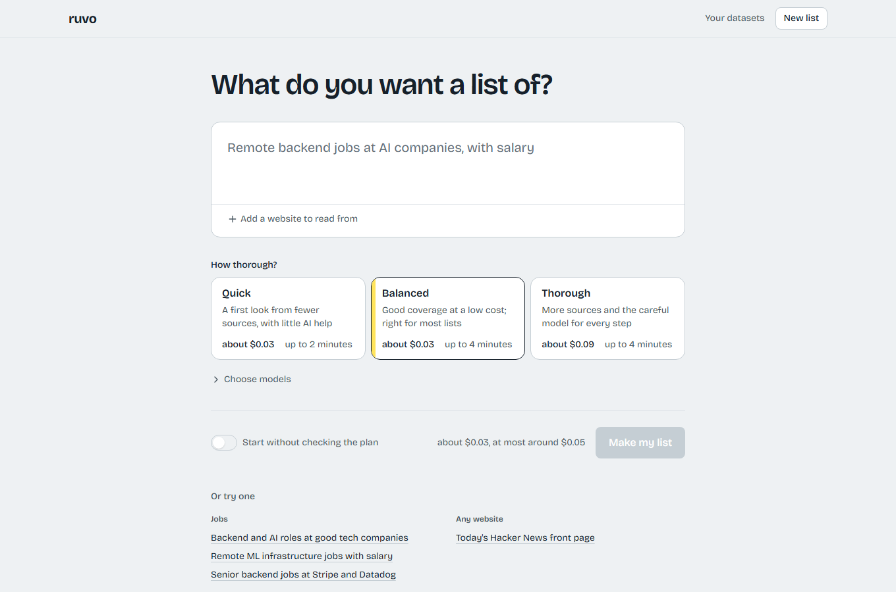
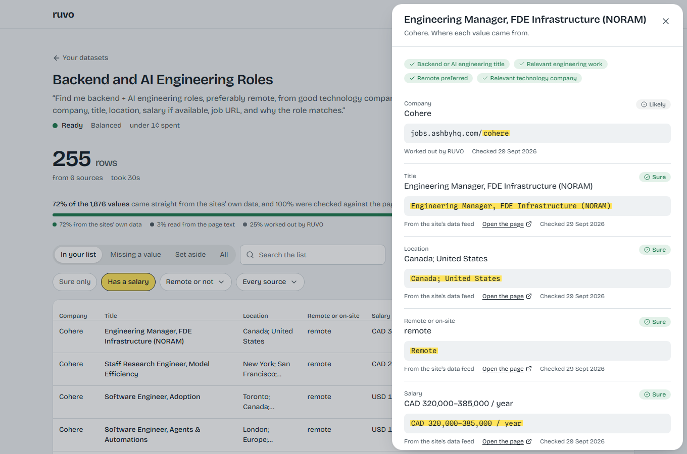

# RUVO

**Ask for a dataset in plain words. Get one back with receipts.**

You write something like

> Find me backend + AI engineering roles, preferably remote, from good technology companies.
> Return company, title, location, salary if available, job URL, and why the role matches.

and RUVO returns a table of a few hundred postings. The difference from asking a chatbot is
that no cell is taken on faith. Every value carries a receipt: where it came from, how it was
read, and how sure RUVO is. Here is one row from a real run:

```
Research Engineer, Life Sciences at Anthropic
────────────────────────────────────────────────────────────────────────────────────────
title     Research Engineer, Life Sciences   API     0.99   $.jobs[365].title
location  San Francisco, CA                  API     0.99   $.jobs[365].location.name
remote    onsite                             API     0.99   $.jobs[365].metadata[0].value
salary    USD 350,000–500,000 / year         REGEX   0.80   "$350,000—$500,000 USD", chars 2815–2836
why       Matches: backend or AI engineering title; relevant engineering work;
          relevant technology company. Not confirmed: remote preferred.
source    https://job-boards.greenhouse.io/anthropic/jobs/5265365008
```

Values that came straight from an API get 0.99. A salary pulled out of the description by a
pattern gets 0.80, with the exact characters it was read from. A value the AI extracted is kept
only if its quote is found on the page and actually states that value. Anything unverified is
dropped, not guessed.

## What happens between the prompt and the table

1. **The request becomes a contract.** An LLM drafts the columns, which ones are required, how
   each record is judged, and the assumptions it made ("good companies" → companies tagged as AI
   labs or dev tools). Code checks it. You review and edit it before anything is collected.
2. **The contract becomes a plan you can read.** It lists the sources, why each was chosen, the
   steps per source, and the page, browser and AI-call budgets. The LLM proposes the plan;
   a compiler checks it, clamps the budgets, and turns it into typed steps.
3. **Sources are collected politely.** Greenhouse, Ashby, Lever and Workable APIs, the Hacker
   News hiring thread, and any list page you link. Plain HTTP comes first. A headless browser is
   used only when a page is an empty JavaScript shell. robots.txt is obeyed, and blocks are never
   worked around.
4. **Web pages are read with recorded recipes.** The first time RUVO sees a list page, an LLM
   proposes CSS selectors. RUVO runs them on the page and keeps them only if they pass
   acceptance checks. Every later run replays them with no AI at all.
5. **Records are judged, checked and merged.** Clear cases are settled by rules. Ambiguous
   titles go to [Jev](https://typesafe.ai), a small decision model, and only what Jev is unsure
   about reaches an LLM judge. Duplicates across sources are merged, keeping the best evidence.
6. **The run leaves something behind.** A quality report, a diff against the previous run,
   repaired recipes, and a remembered plan. The next similar request reuses that plan without
   calling the planner.

When a site changes and a recipe stops fitting, RUVO works out what broke. It then retries,
switches to the browser, patches the selectors locally, or asks the LLM to rediscover the
recipe. The fix is saved as a new version next to the old one, so you can see what changed and
why.

## Run it

You need **Bun 1.4.2+**, **Node 24+**, **Docker**, and an **OpenAI API key**. A TypeSafe key for
Jev is optional; without one, rules and the LLM judge make the calls.

```bash
git clone https://github.com/aizen2006/ruvo && cd ruvo
bun install
docker compose up -d --wait                         # Postgres 17 and Qdrant

cp apps/server/.env.example apps/server/.env        # set OPENAI_API_KEY (and TYPESAFE_API_KEY)
cp apps/web/.env.example apps/web/.env.local

bun run --filter server db:migrate                  # create the tables
bun run --filter server browsers                    # Chromium for Playwright
bun run --filter server smoke                       # optional: checks every dependency

bun run dev                                         # API :3000, worker, dashboard :3001
```

Open **http://localhost:3001**:

1. **Say what you want a list of**, or pick an example. You can add websites for RUVO to read.
2. **Choose how thorough**: Quick, Balanced or Thorough. Each shows what it will cost and how
   long it may take. *Choose models* picks the model for each job yourself.
3. **Check the plan.** It lists the columns (must have or nice to have), the rules, how RUVO
   read vague words, and where it will look. Change anything that's wrong, then press
   **Start collecting**.
4. **Open the list.** Click a row to see its receipt: each value, how sure RUVO is, and the
   source text with the value highlighted. **Download** gives you a spreadsheet.

The contract, workflow, recipes, decisions and full activity log are all still there, behind
**Show details**.





To rehearse a full demo, including a live self-repair on a bundled fake careers site, follow
[docs/demo-script.md](docs/demo-script.md).

## The few settings that matter

All settings live in `apps/server/.env`. The template lists every variable with its default.

| Setting | Default | Change it when |
|---|---|---|
| `OPENAI_API_KEY` | — | Always. Compiling, planning, recipe discovery and the judge use it. |
| `TYPESAFE_API_KEY`, `DECIDER_PROVIDER` | unset, `jev` | You have Jev access. `off` uses rules and the LLM judge only. For a self-hosted Laya, run `docker compose --profile laya up -d` and set `laya` with `DECIDER_BASE_URL=http://localhost:8000`. |
| `FETCH_CACHE_MODE` | `ttl` | You want repeatable demos (`prefer_cache`) or no network at all (`cache_only`). |
| `LLM_CACHE_MODE` | `on` | Identical LLM calls are answered from Postgres. Use `cache_only` for offline replays. |
| `MAX_PAGES`, `MAX_BROWSER_PAGES`, `MAX_LLM_CALLS`, `MAX_RUN_MS` | 300, 20, 150, 8 min | These are ceilings. No mode goes above them, so lower them to cap what anyone can spend. |
| `MODEL_PLANNER`, `MODEL_WORKER` | `gpt-6-sol`, `gpt-6-luna` | You want different default models. The modes are built from this pair. |

Each run has a mode, and the mode sets its budgets:

| Mode | Understands with | Reads with | Pages (browser) | AI calls | Time |
|---|---|---|---|---|---|
| Quick | planner | worker | 40 (3) | 15 | 2 min |
| Balanced (default) | planner | worker | 150 (10) | 60 | 4 min |
| Thorough | planner | planner | 300 (20) | 150 | 8 min |

Quick keeps the planner model for understanding the request because the golden eval fails with
`gpt-6-luna` there: it reads "preferably remote" as a hard requirement. A run's cost counts
every AI call made for it, including understanding and planning. Estimates use token averages
measured from real runs.
| `PORT` | 3000 | If you change it, change `NEXT_PUBLIC_API_URL` in `apps/web/.env.local` to match. |

## Commands

Run these from the repo root, or drop the `--filter server` inside `apps/server`.

| Command | What it does |
|---|---|
| `bun run dev` | API, worker and dashboard, with reload |
| `bun run check-types` | TypeScript across every package |
| `cd apps/server && bun test` | 330+ tests against a throwaway `ruvo_test` database (Postgres must be up). Run it from `apps/server` so `.env.test` applies. |
| `bun run --filter server eval` | Golden prompts with checks on each compiled contract; run it after changing a prompt |
| `bun run --filter server e2e` | The example request end to end against the running stack, then a re-run |
| `bun run --filter server seed:demo` | Warms the caches with the demo requests and resets the demo site |
| `bun run --filter server calibrate` | Re-derives Jev's confidence bands from a finished run (writes `src/decide/calibration.json`) |
| `bun run --filter server probe:registry` | Re-verifies the curated job boards (rewrites `src/plan/data/companies.json`) |

## How it's built

```
apps/server         Bun + Express 5 API and a separate run worker. Drizzle on Postgres
                    (including the job queue), Playwright, cheerio, OpenAI, Jev.
apps/web            Next.js 16 dashboard: Tailwind v4, shadcn/ui-style components on Radix,
                    TanStack Query. docs/design-system.md covers tokens, words and components.
packages/contracts  zod schemas both sides share: contract, plan, workflow IR, records, runs.
docs/               architecture.md explains the whole path through the code;
                    demo-script.md is an 8-minute walkthrough.
```

A few rules shaped the code:

- **The model proposes; code decides.** An LLM writes small typed drafts: a contract, a plan,
  a recipe. Deterministic code checks each draft and runs it. If a draft fails, the fallback is
  a template, not another prompt.
- **Postgres is the only source of truth.** It holds the queue, the page cache, the LLM cache,
  the decision cache and the evidence. Qdrant and Jev only speed things up; when they fail,
  RUVO skips them.
- **Everything nondeterministic is cached.** That makes re-runs reproducible, lets a crashed run
  resume by replaying, and lets a demo run fully offline.
- **Budgets degrade a run instead of failing it.** When the AI budget runs out, remaining steps
  carry on without AI and the run says so. At the time limit, slow steps stop and what was
  gathered is still saved.

## Limits, honestly

- **Jobs are the deep domain.** Other kinds of data work only from list pages you link. RUVO
  reads one page per link: it does not paginate, click, or log in.
- **Some sites say no.** lib.rs, for example, refuses RUVO's crawler, and RUVO stops there.
  `Crawl-delay` is honoured up to 10 seconds.
- **The AI judge can be wrong.** It once rejected "Senior Member of Technical Staff, Multimodal
  AI" as not an AI role. Rules settle the clear cases first, so the judge only sees ambiguous ones.
- **The private-network guard checks DNS before fetching, not at connect time.** A hostile DNS
  server could still rebind a name between the two lookups. Run RUVO where that matters.
- **Some numbers are approximate.** Cost estimates are averages; budgets cap the number of AI
  calls, not their length. The workflow-memory threshold (0.9 similarity) is tuned on a handful
  of requests.
- **There are no accounts.** The API has no authentication. It is built for one person on one
  machine.

## License

No license has been chosen yet, so all rights are reserved by the author for now.
